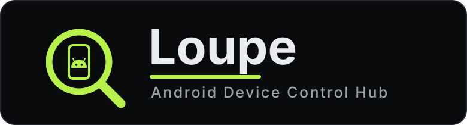

Control, inspect, and debug an Android phone from your browser. It needs no drivers, no desktop `adb` server, and no agent app on the device.

---

Loupe is a browser based console for Android devices. It speaks the ADB
wire protocol straight from the page, so a live screen mirror, a real shell, a file manager, logcat, proxy interception, memory dumps, and Frida all run in one tab. Plug the phone in over USB, or connect to it over Wi-Fi.

## Features

- **Screen mirror and control.** Live H.264 mirror over [scrcpy](https://github.com/Genymobile/scrcpy), decoded in the browser with WebCodecs. Touch, drag, swipe, scroll, the hardware keys, notification shade, rotate, wake. Take a screenshot or record the screen to your computer with no time limit.
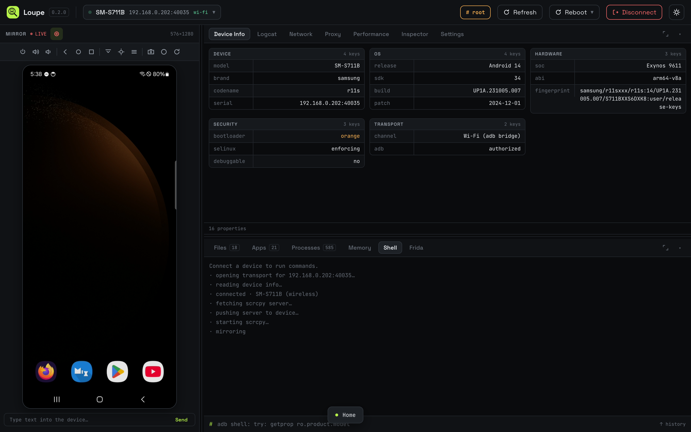

- **Logcat.** Live stream with per level filters, text search, and a per app filter that narrows to one app's processes. Pause and export at any time.
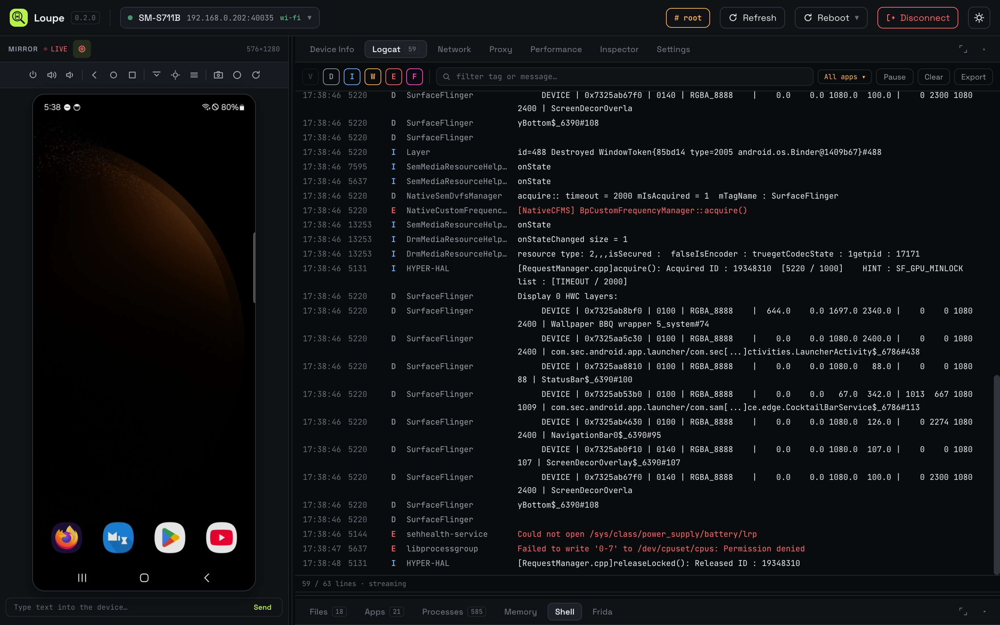

- **Network.** Live socket table with protocol, state, addresses, and the owning process.
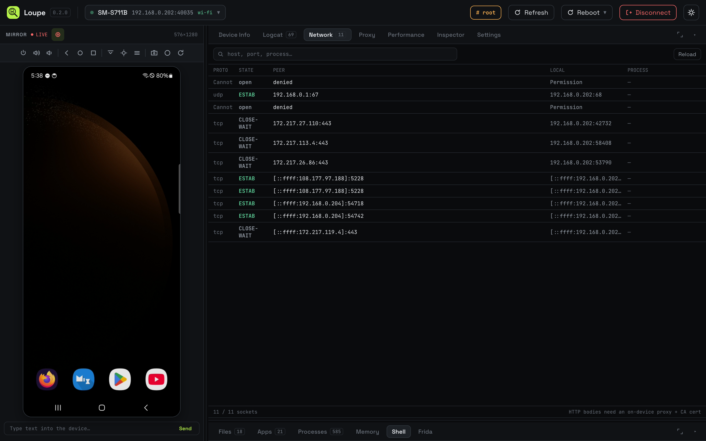

- **Performance.** A live device dashboard sampled every two seconds: CPU, memory, and the foreground app's FPS with sparklines, battery (level, status, health, temperature, voltage), network (type, SSID, IP, signal, link speed, throughput), storage, uptime, and load average.
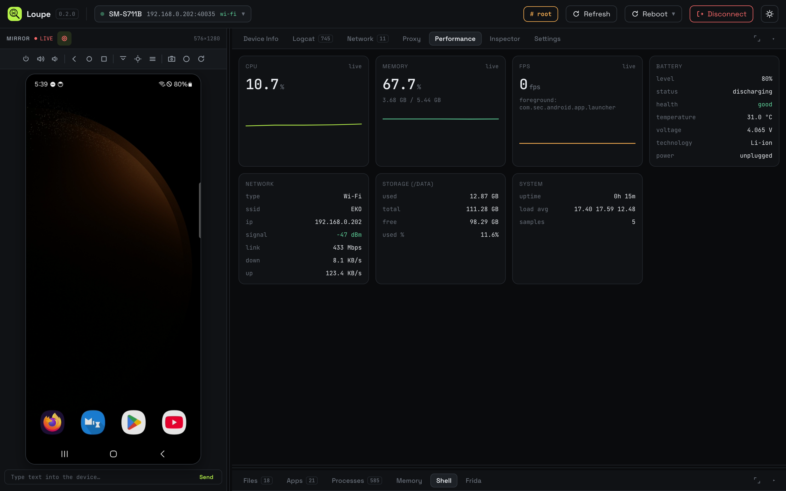

- **Memory.** Read `dumpsys meminfo` and `/proc/<pid>/maps`, and capture a heap dump. When `am dumpheap` cannot help, it writes an ELF core that opens in gdb, LLDB, radare2, or Ghidra.
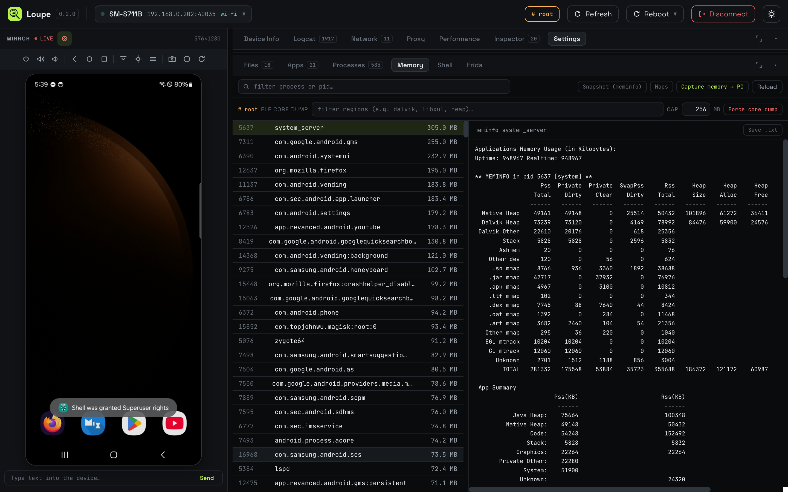

- **Inspector.** Dump the view hierarchy into a tree with per node attributes.
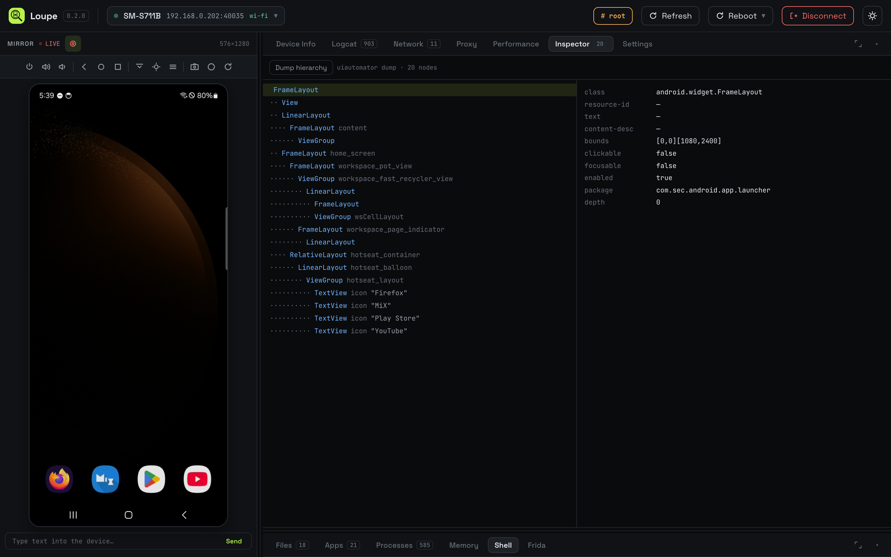

- **Settings.** Browse, search, and edit the `system`, `secure`, and `global` settings namespaces. Pick a key to change its value or delete it.
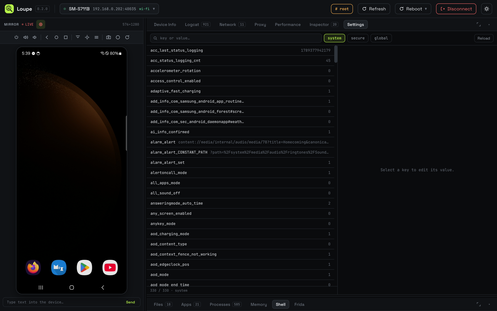

- **Device Info.** Live `getprop`, grouped into cards.
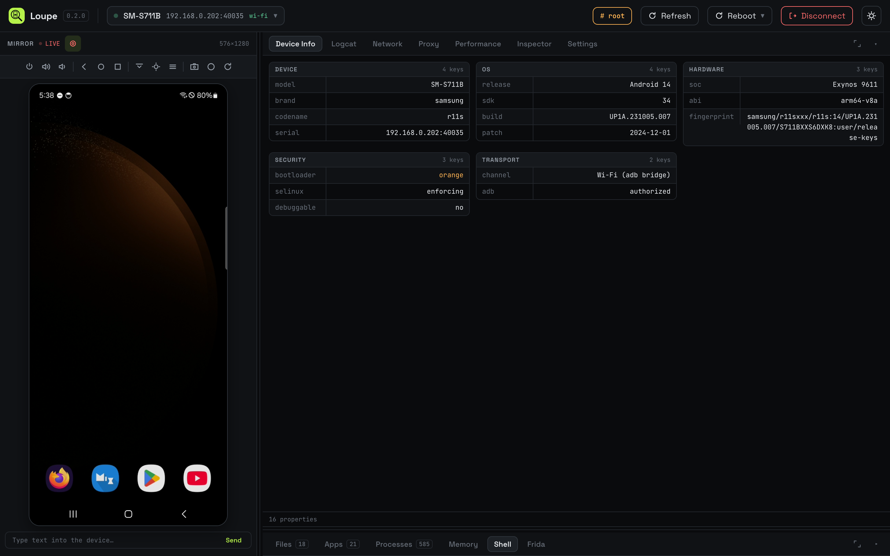

- **Files.** Browse, search, upload, download, copy, move, and delete. Previews images, text and config, HTML (rendered), PDFs, audio and video, and SQLite databases in a table browser.
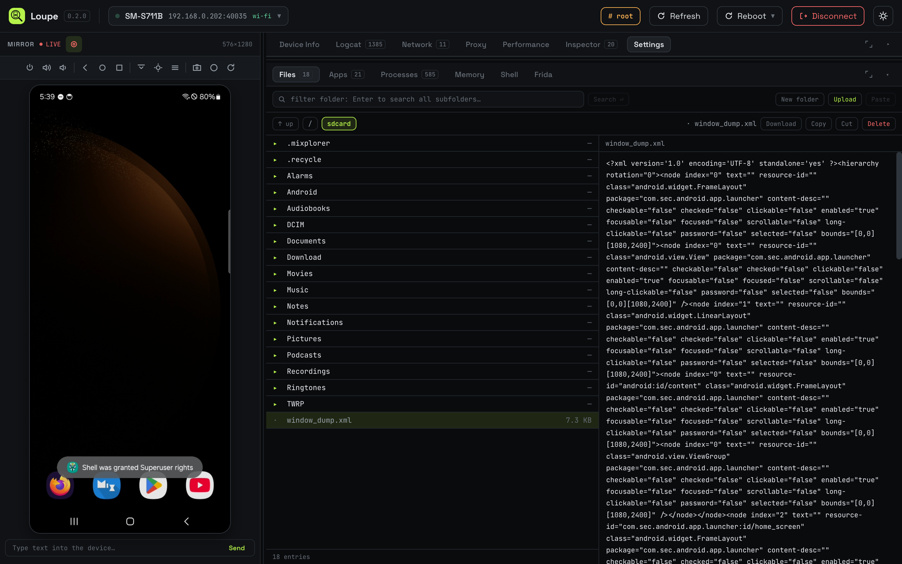

- **Apps.** List user, system, or all packages, each with its launcher icon and a readable name, sorted by name. Read details from `dumpsys`, install an APK, uninstall, launch, force stop, enable or disable, and clear data or cache.
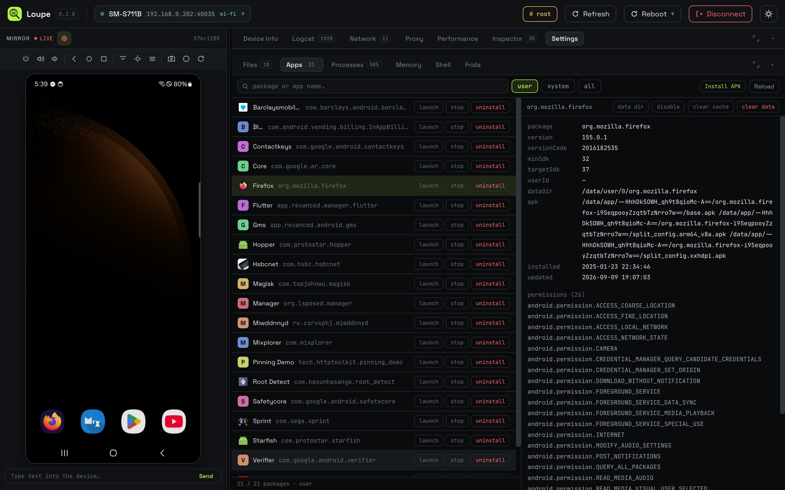

- **Processes.** Live process table with the app name, package, and per process CPU and memory. Click any column to sort. Kill or force stop.
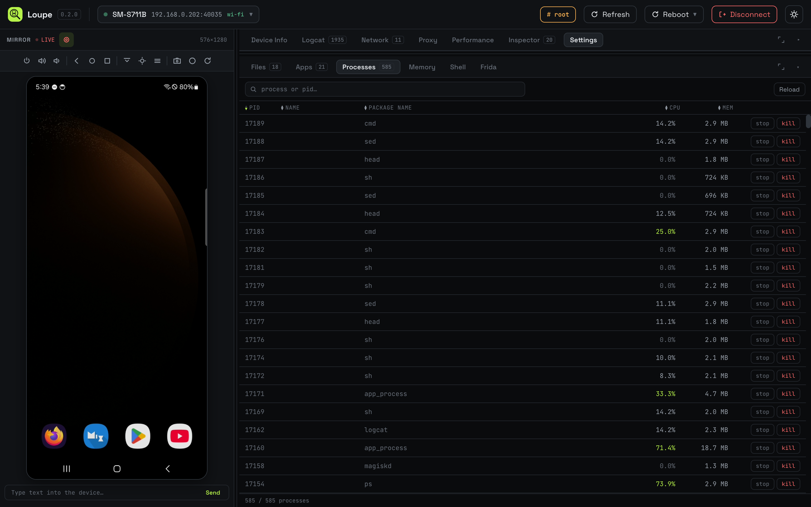

- **Shell.** A real `adb shell` with command history. The prompt shows `#` when the elevated shell is on, `$` when it is not.
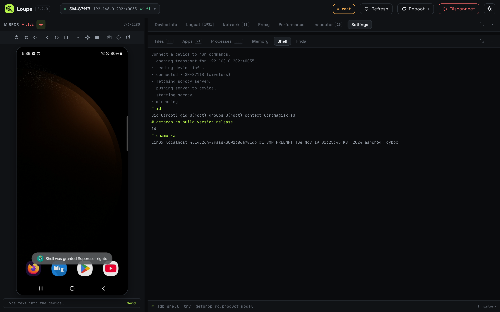

- **Reboot.** A menu in the header to reboot the device to system, recovery, or bootloader.

- **Frida.** Download, install, start, and stop `frida-server` on the device, then pick a target app, run a script against it, and watch its output stream in. No manual `adb push`. It runs the same over USB and Wi-Fi, because Loupe reaches `frida-server` through the browser's own device connection rather than the host `adb`. Paste a link instead of a script and Loupe fetches it on Run, from Frida CodeShare, a GitHub file, or a Gist. Scripts written for Frida 16 keep working too: Loupe restores the `Java` bridge and the other globals Frida 17 removed.
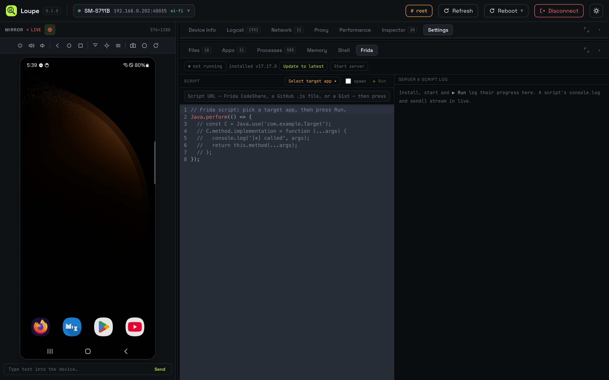

- **Proxy.** Point the device's global proxy at your own intercepting proxy (Burp, HTTP Toolkit, or any other) with one Start/Stop button, test that the phone can reach it, and install its CA into the system trust store so HTTPS decrypts. On a Magisk or KernelSU device the CA install is a boot module, so it survives reboots.
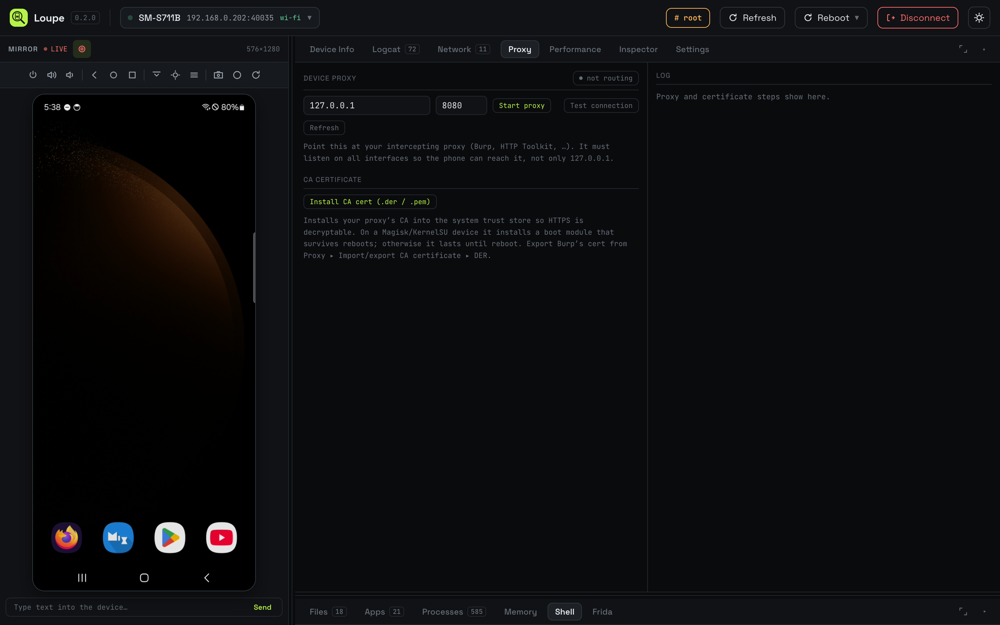

- **Two-pane workspace.** The panels sit in two stacked tab strips, so you can watch one while working in another: logcat streaming while a Frida script runs, or Performance while you kill processes. Drag any tab from one strip to the other to arrange the panes however you like, drag the divider to resize, and maximize either pane to fill the space.
- **Root aware.** On a rooted device, Loupe detects root on connect and reaches
  protected paths, other processes, and non debuggable heap dumps.

## Getting started

A Chromium browser (Chrome or Edge, since WebUSB is Chromium only),
Node 20 or newer, and a phone with USB debugging turned on.

```bash
git clone https://github.com/capt-meelo/loupe
cd loupe
npm install
npm run dev
```

Open <http://localhost:5173>. The dev server also starts the Loupe bridge on
port `8090`, which the ADB, Frida, and Proxy features use. (Not 8080: that's the default port for Burp and other intercepting proxies.)

Other scripts:

```bash
npm run build      # production bundle into dist/
npm run preview    # serve the production build
```

### Connecting a device

**Over USB.** Turn on USB debugging and plug the phone in. Stop any desktop adb
server first, since it holds the USB interface:

```bash
adb kill-server
```

Then open the device menu, pick **Connect a device over USB**, and tap **Allow
USB debugging** on the phone.

**Over Wi-Fi.** Open the device menu and pick **Connect over Wi-Fi**. Pair with a
code or a QR the first time, or type an `address:port` if the phone is already
paired. Wi-Fi needs `adb` installed on your machine, since the bridge drives it
for pairing and mDNS. USB needs nothing installed.

## Built with

- [ya-webadb](https://github.com/yume-chan/ya-webadb) (`@yume-chan/adb` and
  friends) for the ADB protocol over WebUSB and for the scrcpy client
- [scrcpy](https://github.com/Genymobile/scrcpy) for screen mirroring, decoded
  with the browser's [WebCodecs](https://developer.mozilla.org/en-US/docs/Web/API/WebCodecs_API) API
- [Frida](https://frida.re) and [frida-node](https://github.com/frida/frida-node) for
  the instrumentation panel
- [sql.js](https://github.com/sql-js/sql.js) to read SQLite databases in the browser
- [React](https://react.dev) and [Vite](https://vitejs.dev)

## Notes for contributors

Architecture, the security model, the connection internals, and troubleshooting
live in [`DEVELOPMENT.md`](DEVELOPMENT.md).
