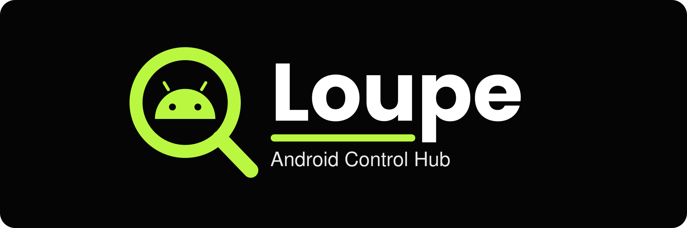
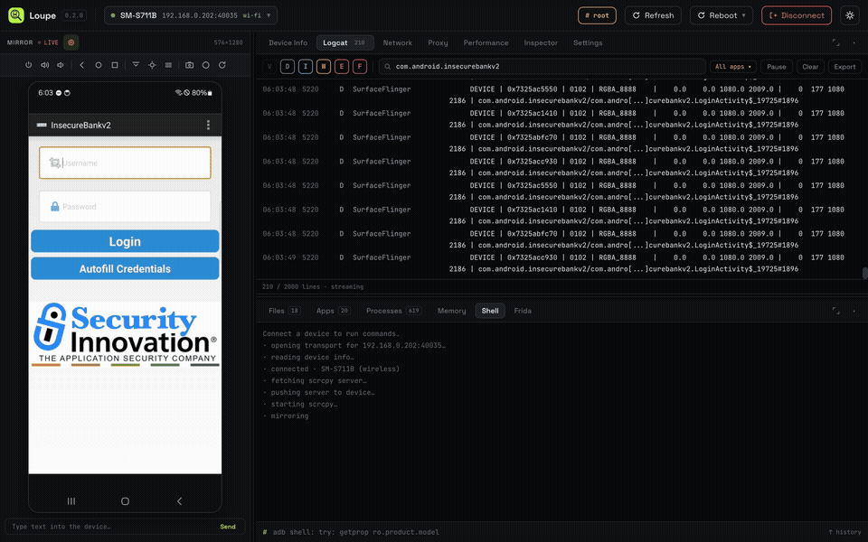
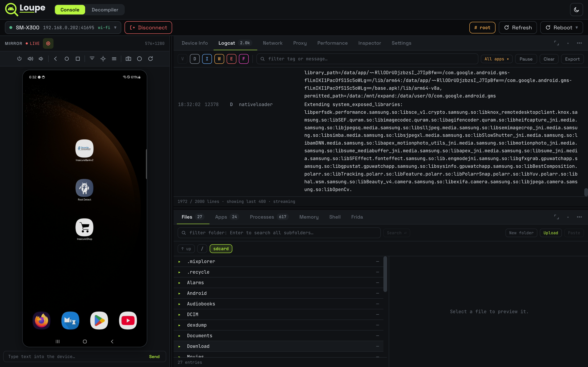
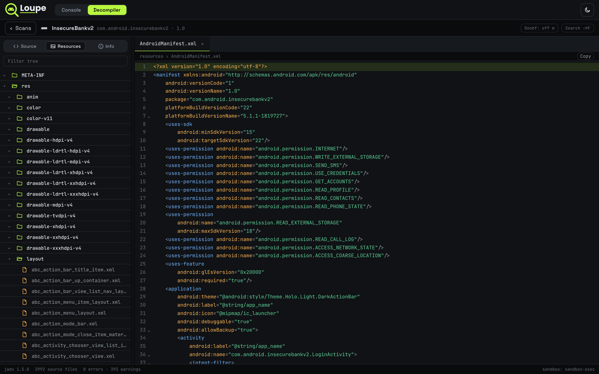

Control, inspect, and debug an Android phone from your browser, and decompile its apps in the same tab. Over USB it needs no drivers, no desktop `adb` server, and no agent app on the device. Over Wi-Fi it uses the `adb` tools already on your computer.

---

Loupe is a browser-based console for Android devices. It speaks the ADB
wire protocol straight from the page, so a live screen mirror, a shell, a file manager, logcat, proxy interception, memory dumps, and Frida all run in one tab. Plug the phone in over USB, or connect to it over Wi-Fi.

A second view, the Decompiler, turns an APK into readable Java, a decoded manifest and resources, and a searchable source tree, with a signature check. Open an APK from disk or pull an installed app straight from the phone, and read it without leaving Loupe.



## Features

### Console



- **Screen mirror and control.** Live H.264 mirror over [scrcpy](https://github.com/Genymobile/scrcpy), decoded in the browser with WebCodecs. Touch, drag, swipe, scroll, the hardware keys, notification shade, rotate, wake. Take a screenshot (saved to your computer, with a copy sent to the clipboard when the browser allows it) or record the screen with no time limit.

- **Logcat.** Live stream with per-level filters, text search, and a per-app filter that narrows to one app's processes. Pause and export at any time.

- **Network.** Live socket table with protocol, state, addresses, and the owning process.

- **Performance.** A live device dashboard sampled every two seconds: CPU, memory, and the foreground app's FPS with sparklines, battery (level, status, health, temperature, voltage), network (type, SSID, IP, signal, link speed, throughput), storage, uptime, and load average.

- **Memory.** Read `dumpsys meminfo` and `/proc/<pid>/maps`, and capture a heap dump. When `am dumpheap` cannot help, it writes an ELF core that opens in gdb, LLDB, radare2, or Ghidra.

- **Inspector.** Dump the view hierarchy into a tree with per-node attributes.

- **Settings.** Browse, search, and edit the `system`, `secure`, and `global` settings namespaces. Pick a key to change its value or delete it.

- **Device Info.** Live `getprop`, grouped into cards.

- **Files.** Browse, search, upload, download, copy, move, and delete. Previews images, text and config, HTML (rendered), PDFs, audio and video, and SQLite databases in a table browser.

- **Apps.** List user, system, or all packages, sorted by name. Each row shows a launcher icon when one can be extracted and a name derived from the package. Read details from `dumpsys`, install an APK, uninstall, launch, force stop, enable or disable, and clear data or cache. Destructive actions ask for confirmation first.
  - When Android blocks an install, Loupe asks before overriding it. If Play Protect holds the install, **Install anyway** turns off Play Protect scanning for installs over adb (the `verifier_verify_adb_installs` setting, which stays off until you turn it back on). If Android 14 or later refuses an app built for an old Android version, **Install anyway** retries with `--bypass-low-target-sdk-block`.

- **Processes.** Live process table with the app name, package, and per-process CPU and memory. Click any column to sort. Kill or force stop.

- **Shell.** An `adb shell` with command history. The prompt shows `#` when the elevated shell is on, `$` when it is not.

- **Reboot.** A menu in the header to reboot the device to system, recovery, or bootloader.

- **Frida.** Download, install, start, and stop `frida-server` on the device, then pick a target app, run a script against it, and watch its output stream in. No manual `adb push`.
  - It runs the same over USB and Wi-Fi, because Loupe reaches `frida-server` through the browser's own device connection instead of the host `adb`.
  - Loupe installs the `frida-server` release that matches its own Frida client. A server of a different release can connect and then hang or crash the target app.
  - Paste a link instead of a script and Loupe fetches it on Run, from Frida CodeShare, a GitHub file, or a Gist.
  - Many scripts written for Frida 16 also run: Loupe adds back the `Java` bridge and a few `Module` and `Memory` helpers that Frida 17 removed.

- **Proxy.** Point the device's global proxy at your own intercepting proxy (Burp, HTTP Toolkit, or any other) with one Start/Stop button, check from this computer that the proxy is reachable, and install its CA into the system trust store so HTTPS decrypts. On a Magisk or KernelSU device the CA install is a boot module, so it survives reboots. The phone still needs its own route to the proxy's address.

- **Two-pane workspace.** The panels sit in two stacked tab strips, so you can watch one while working in another: logcat streaming while a Frida script runs, or Performance while you kill processes.
  - Drag any tab from one strip to the other, drag the divider to resize, and maximize either pane to fill the space.
  - Each pane's `⋯` menu jumps to a tab, moves the active tab across, or resets the layout. Pane sizes are remembered between visits.
- **Root-aware.** On a rooted device, Loupe detects root on connect and reaches protected paths, other processes, and non-debuggable heap dumps.

### Decompiler

Switch to it from the header (`Console | Decompiler`). It is a second full-window view that reads like jadx-gui.



- **Open an APK.** Choose one or more `.apk` files, drop them anywhere in the window, or pull an installed app from the connected phone. Several different apps at once decompile one after another.
- **Read the app.** Decompiled Java, the decoded manifest and resources, and a source tree with a filter and file icons. Search across code, resources, and names jumps to the match. Deobfuscation options sit behind the **Deobf** button.
- **Recent scans.** The start screen keeps a table with each app's icon, name, package, version, SDK range, MD5, size, and scan time. Search it, sort it, click a row to reopen it, copy the package name or MD5, or delete a scan from the cache.
- **APK info.** The manifest facts in groups (identity, SDK range, build, security flags), plus a signature check for v1 through v3.1.
- **One-click setup.** The first time you decompile, Loupe asks before downloading a private Java runtime and jadx (about 140 MB, checksum-pinned) into `~/.loupe/tools`, then decompiles right away. jadx runs inside an OS sandbox on macOS and Linux (Linux has been run under WSL2 only). Windows has no sandbox Node can use, so the decompiler is off there; see [Windows](#windows).

## Getting started

A Chromium browser (Chrome or Edge, since WebUSB is Chromium only),
Node 20 or newer, and a phone with USB debugging turned on.

```bash
git clone https://github.com/capt-meelo/loupe
cd loupe
npm install
npm run dev
```

Open <http://localhost:5173>. The dev server also starts the Loupe bridge on
port `8090`, which the ADB, Frida, and Proxy features use. (Not 8080: that's the default port for Burp and other intercepting proxies.)

The decompiler runs jadx in an OS sandbox. macOS has one built in, so there is nothing to install. On Linux, install `bubblewrap` first (`sudo apt install bubblewrap`, or the same package name with `dnf` or `pacman`). Without it the decompiler stays off.

Other scripts:

```bash
npm run build      # production bundle into dist/
npm run preview    # serve the built UI only, with no bridge
```

`npm run preview` has no bridge behind it, so Wi-Fi, Frida, Proxy, and the Decompiler don't work there. Use `npm run dev` for everything.

### What each feature needs

| Feature | Needs on your computer | Needs on the phone |
|---|---|---|
| USB connection | Nothing extra | USB debugging |
| Wi-Fi connection | `adb` | Wireless debugging |
| Decompiler | Network access once, to download Java and jadx. On Linux, `bubblewrap` | Nothing |
| Frida server install | `xz`, and network access to GitHub | Root, to start the server |
| Proxy CA install | `openssl` | Root |
| Protected files, other processes' memory | Nothing | Root |

### Windows

Everything except the decompiler should run natively on Windows, but native Windows has not been tested. Frida install needs `xz` and the proxy CA step needs `openssl` on your `PATH`, and neither ships with Windows. For the decompiler, run Loupe inside [WSL2](https://learn.microsoft.com/windows/wsl/install) with Ubuntu, where jadx gets the same Linux sandbox, and keep using Chrome on Windows:

```bash
sudo apt install bubblewrap xz-utils openssl android-tools-adb   # sandbox, Frida server install, proxy CA step, Wi-Fi adb
npm install && npm run dev
```

Open <http://localhost:5173> in Windows Chrome. USB mirroring still works because WebUSB runs in Windows Chrome, not in WSL. Wi-Fi uses the `adb` inside WSL. Ubuntu's apt `adb` is built without mDNS, so the QR tab and the automatic connect-port lookup find nothing. Use the **Pair code** tab, then the **Connect** tab with the connect `ip:port` shown on the phone's Wireless debugging screen. If `.wslconfig` sets `networkingMode=mirrored`, WSL hangs on connections to closed loopback ports instead of refusing them, which stalls `adb start-server`. Loupe starts the adb server itself on Linux. If you run adb by hand, use `adb -L tcp:5037 server nodaemon &`, and skip the **Stop adb server** button. Some WSL kernels, such as Ubuntu 24.04 with a newer kernel, have `kernel.apparmor_restrict_unprivileged_userns`, which can make the decompiler report that its sandbox failed. If it does, run `sudo sysctl -w kernel.apparmor_restrict_unprivileged_userns=0`. Kernel 5.15.167.4 does not have that setting.

### Connecting a device

**Over USB.** Turn on USB debugging and plug the phone in. Stop any desktop adb
server first, since it holds the USB interface:

```bash
adb kill-server
```

Then open the device menu, pick **Connect a device over USB**, and tap **Allow
USB debugging** on the phone.

**Over Wi-Fi.** Open the device menu and pick **Connect over Wi-Fi**. Pair with a
code or a QR the first time, or type an `address:port` if the phone is already
paired. Wi-Fi needs `adb` installed on your machine, since the bridge drives it
for pairing and mDNS. USB needs nothing installed.

## Built with

- [ya-webadb](https://github.com/yume-chan/ya-webadb) (`@yume-chan/adb` and
  friends) for the ADB protocol over WebUSB and for the scrcpy client
- [scrcpy](https://github.com/Genymobile/scrcpy) for screen mirroring, decoded
  with the browser's [WebCodecs](https://developer.mozilla.org/en-US/docs/Web/API/WebCodecs_API) API
- [Frida](https://frida.re) and [frida-node](https://github.com/frida/frida-node) for
  the instrumentation panel
- [jadx](https://github.com/skylot/jadx) and an [Eclipse Temurin](https://adoptium.net) JRE for the decompiler
- [CodeMirror](https://codemirror.net) to show source
- [sql.js](https://github.com/sql-js/sql.js) to read SQLite databases in the browser
- [React](https://react.dev) and [Vite](https://vitejs.dev)

## Notes for contributors

Architecture, the security model, the connection internals, and troubleshooting
live in [`DEVELOPMENT.md`](DEVELOPMENT.md).
